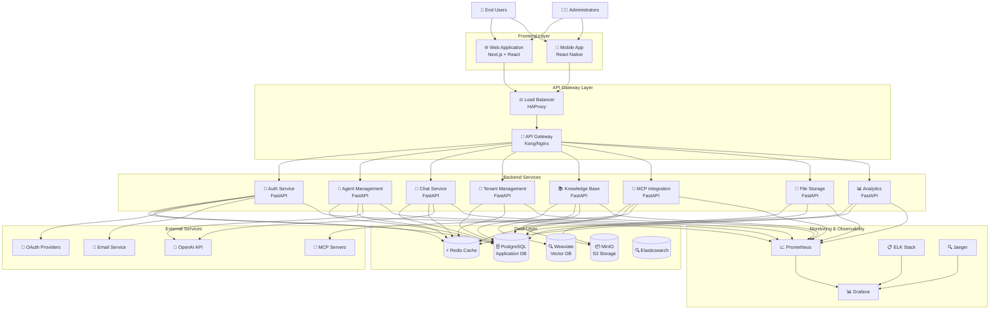
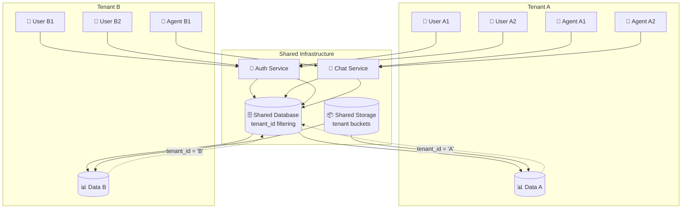
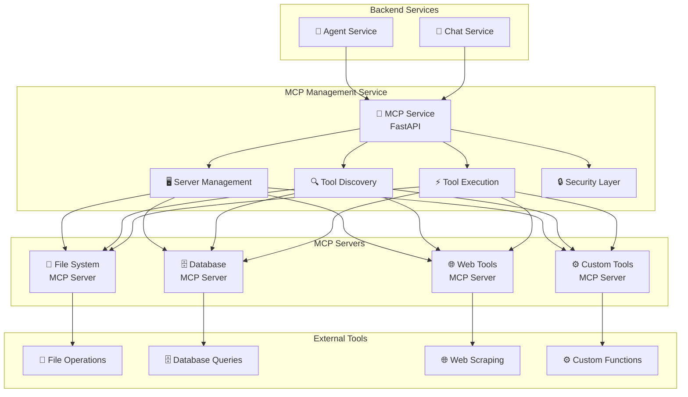
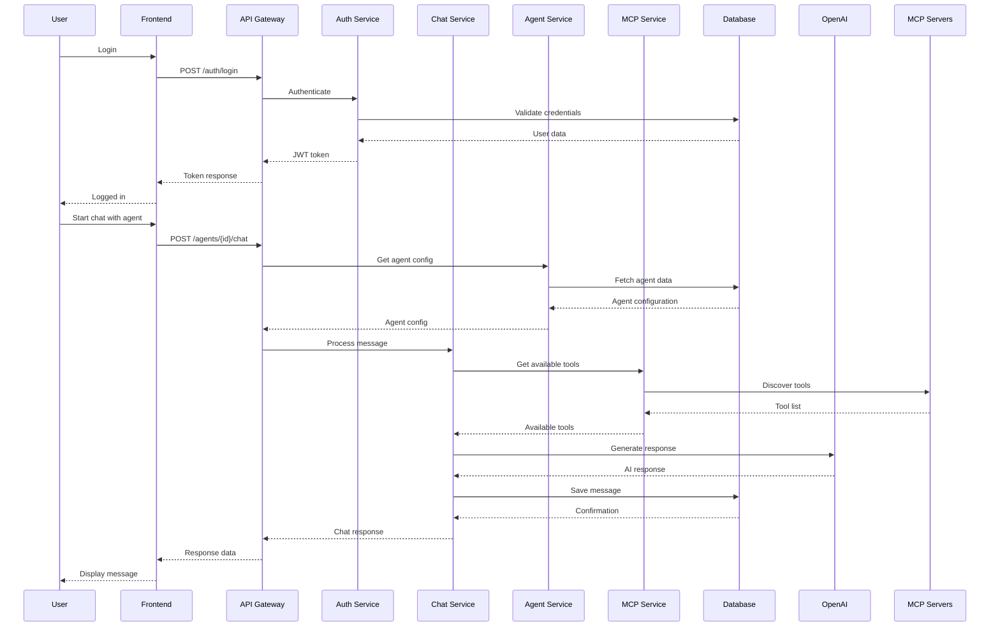
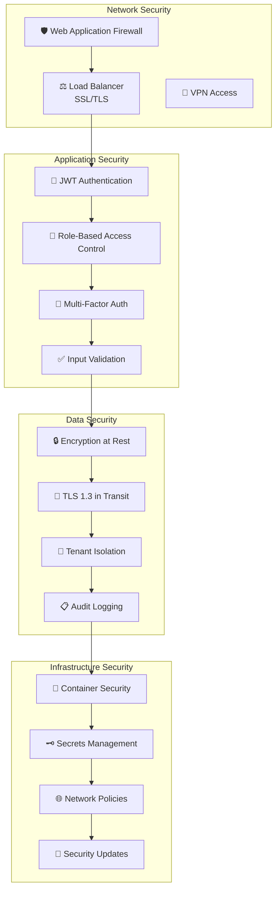
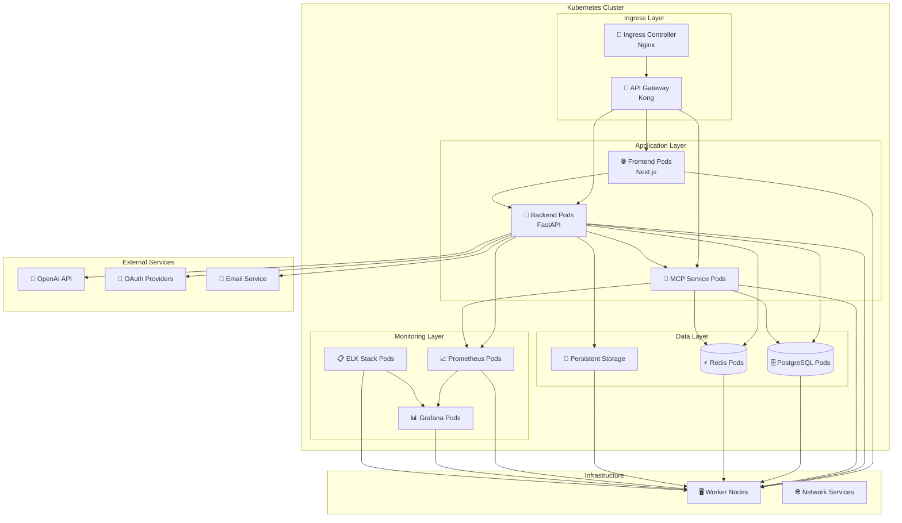
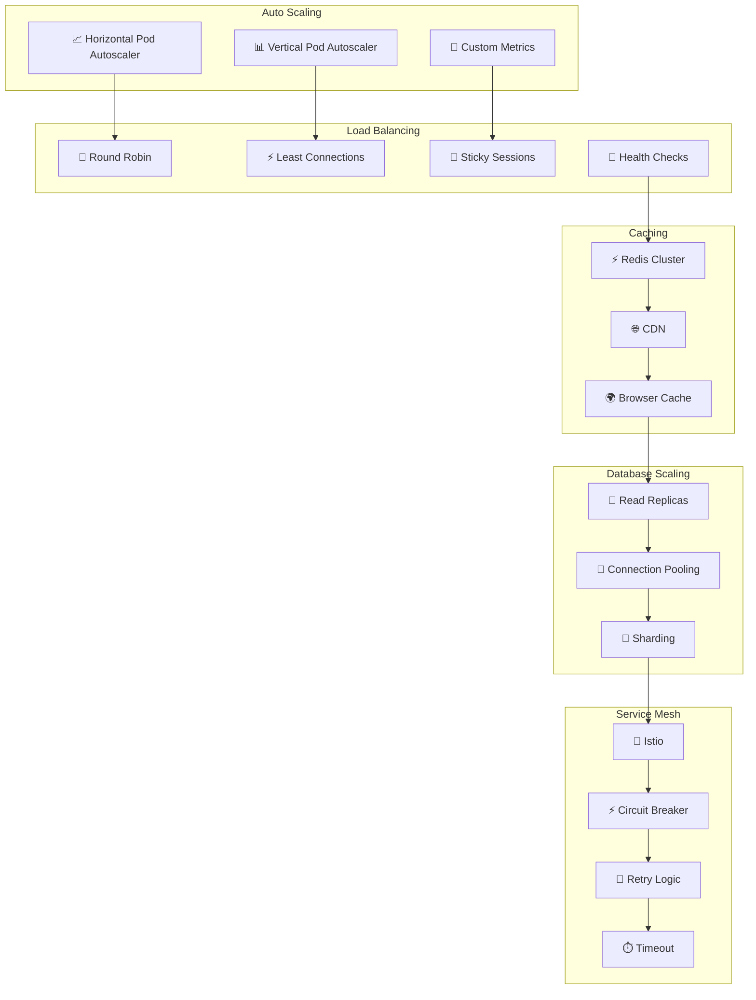
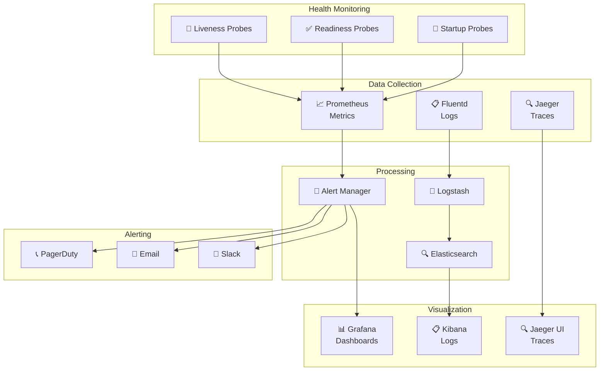

# Architecture Diagram

## System Overview

## Multi-Tenant Architecture

## MCP Integration Architecture

## Data Flow Architecture

## Security Architecture

## Deployment Architecture

## Scalability Architecture

## Monitoring Architecture

